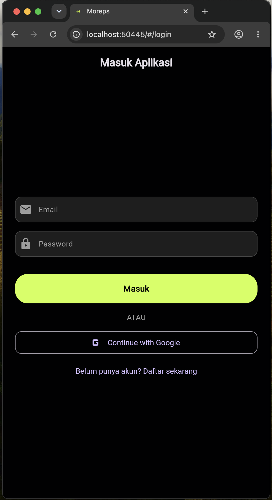
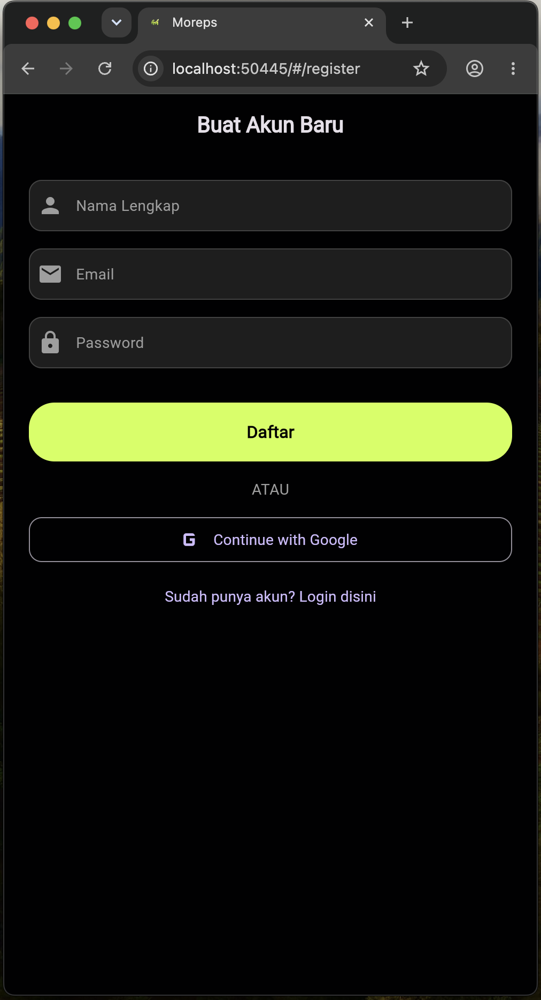
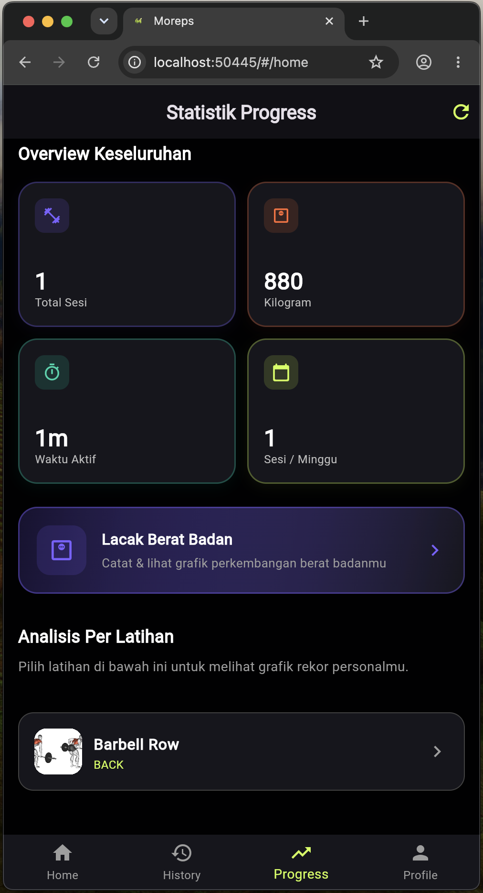
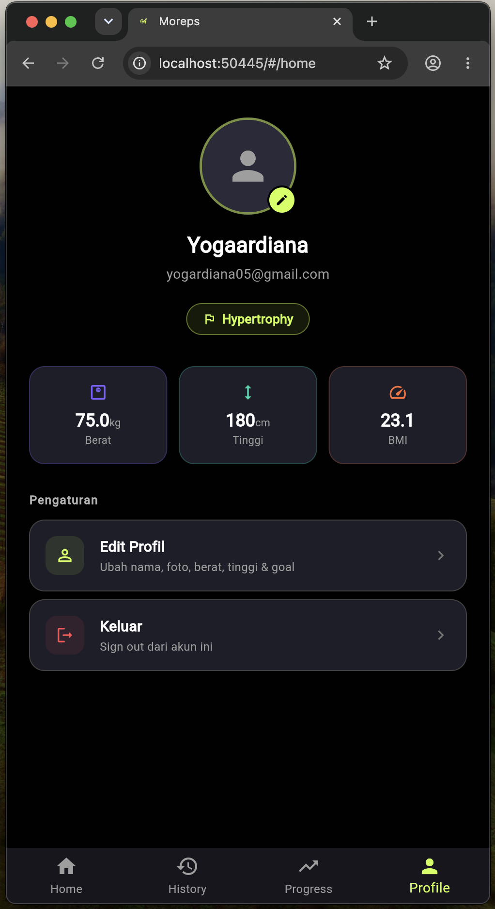

<div align="center">


# 💪 MOREPS

### *Your Personal Workout Tracker & Strength Analyzer*

[](https://flutter.dev)
[](https://dart.dev)
[](https://supabase.com)
[]()

<br/>

**Moreps** adalah aplikasi pelacak kebugaran (*workout tracker*) komprehensif yang dirancang untuk membantu pengguna mencatat sesi angkat beban, melacak perkembangan kekuatan fisik, dan memonitor perubahan berat badan. Dilengkapi dengan fitur deteksi **Personal Record (PR)** otomatis dan sistem analitik visual berbasis grafik untuk memotivasi pengguna mencapai target kebugaran mereka.

<br/>

[📖 Dokumentasi PRD](PRD.md) · [🎬 Demo Video](#-demo-video) · [📸 Screenshots](#-screenshot-halaman) · [🔗 Official Website](https://moreps.vercel.app/)

---

</div>

<br/>

## 👥 Profile Pengembang

<table align="center">
  <tr>
    <th>No</th>
    <th>Nama</th>
    <th>NIM</th>
    <th>Role</th>
  </tr>
  <tr>
    <td align="center">1</td>
    <td><b>Komang Yoga Ardiana</b></td>
    <td><code>2401010105</code></td>
    <td>📋 PM & Fullstack Developer</td>
  </tr>
  <tr>
    <td align="center">2</td>
    <td><b>Gede Adprian Pratama</b></td>
    <td><code>2401010117</code></td>
    <td>🎨 UI/UX & Fullstack Developer</td>
  </tr>
  <tr>
    <td align="center">3</td>
    <td><b>I Putu Nova Perwira Andika</b></td>
    <td><code>2401010112</code></td>
    <td>💻 Fullstack Developer</td>
  </tr>
</table>

<br/>

---

## 🛠️ Tech Stack

<div align="center">

| Layer | Teknologi | Keterangan |
|:---:|:---:|:---|
| **Frontend** |   | Framework UI cross-platform (Android & iOS) |
| **Backend** |  | BaaS — PostgreSQL Database, Auth, Storage |
| **State Management** |  | Reactive state management (Notifier, AsyncNotifier) |
| **Routing** |  | Deklaratif routing dengan deep linking support |
| **UI Charts** |  | Grafik interaktif (Progress & PR Tracker) |
| **Design** | 🎨 Dark Mode + Glassmorphism | Palet `#010102` dengan aksen hijau neon `#CFFF4B` |

</div>

<br/>

---

## 📁 Struktur Folder `lib/`

```
lib/
├── main.dart                     # Entry point aplikasi, inisialisasi provider & routing
│
├── core/                         # Konfigurasi inti & utilitas global
│   ├── navigation/               # Setup bottom navigation & main wrapper shell
│   ├── services/                 # Service layer (notifikasi lokal, vibration, dsb.)
│   └── theme/                    # Tema aplikasi (warna, ukuran, dark mode config)
│
├── features/                     # Modul fitur (dipisah per domain bisnis)
│   ├── auth/                     # Autentikasi (Login, Register, Onboarding)
│   │   ├── models/               # Data model untuk user & auth state
│   │   ├── pages/                # Halaman UI (Sign In, Sign Up, Onboarding)
│   │   ├── providers/            # State management (auth notifier/provider)
│   │   └── services/             # Repository akses Supabase Auth
│   │
│   ├── home/                     # Dashboard utama
│   │   └── pages/                # Halaman Home (Workout Templates & Library)
│   │
│   ├── workout/                  # Manajemen sesi latihan
│   │   ├── models/               # Model data (Workout, Exercise, Set)
│   │   ├── pages/                # Halaman Builder, Active Session, Summary
│   │   ├── providers/            # State workout session & timer
│   │   ├── repositories/         # Akses data Supabase (CRUD workout)
│   │   └── widgets/              # Komponen UI reusable (exercise card, set row)
│   │
│   ├── history/                  # Riwayat latihan
│   ├── progress/                 # Analitik & pelacakan progres (PR, Body Weight)
│   └── profile/                  # Manajemen profil pengguna & BMI Calculator
│
└── shared/                       # Komponen & utilitas yang digunakan lintas fitur
    └── widgets/                  # Widget reusable global (buttons, cards, dialogs)
```

> **Arsitektur:** Menggunakan *Feature-First Structure* dengan *Repository/Service Pattern* untuk memisahkan logika bisnis dari UI layer.

<br/>

---

## ✨ Daftar Fitur

<table>
  <tr>
    <th>Kategori</th>
    <th>Fitur</th>
    <th>Deskripsi</th>
  </tr>
  <tr>
    <td rowspan="3">🔐 <b>Autentikasi</b></td>
    <td>Sign Up & Sign In</td>
    <td>Registrasi & login via Email/Password atau Google OAuth</td>
  </tr>
  <tr>
    <td>Smart Session Check</td>
    <td>Auto-redirect berdasarkan status sesi pengguna di Splash Screen</td>
  </tr>
  <tr>
    <td>Onboarding Profil</td>
    <td>Pengumpulan data awal: Nama, Tanggal Lahir, Berat, Tinggi, Fitness Goal</td>
  </tr>
  <tr>
    <td rowspan="3">🏠 <b>Dashboard</b></td>
    <td>Premium Greeting Card</td>
    <td>Sapaan dinamis berdasarkan waktu (Pagi/Siang/Malam) dengan tanggal Indonesia</td>
  </tr>
  <tr>
    <td>Workout Templates</td>
    <td>Buat, edit, hapus template latihan dengan estimasi durasi & target otot</td>
  </tr>
  <tr>
    <td>Exercise Library</td>
    <td>Direktori gerakan dengan filter ChoiceChips berdasarkan grup otot</td>
  </tr>
  <tr>
    <td rowspan="4">🏋️ <b>Sesi Latihan</b></td>
    <td>Workout Builder</td>
    <td>Rakit template dengan drag-and-drop, penambahan set, konversi KG ↔ LBS</td>
  </tr>
  <tr>
    <td>Active Tracker</td>
    <td>Pencatatan real-time: timer, reps, beban, spontaneous exercise</td>
  </tr>
  <tr>
    <td>Rest Timer & Motivasi</td>
    <td>Countdown istirahat dengan notifikasi, getaran, & kutipan motivasi</td>
  </tr>
  <tr>
    <td>Session Summary</td>
    <td>Ringkasan pasca-latihan: volume, durasi, set, dan highlight PR baru</td>
  </tr>
  <tr>
    <td rowspan="3">📅 <b>Riwayat</b></td>
    <td>Workout Calendar</td>
    <td>Kalender visual dengan marker neon pada tanggal latihan</td>
  </tr>
  <tr>
    <td>Infinite Scroll History</td>
    <td>Daftar riwayat dengan pagination untuk performa optimal</td>
  </tr>
  <tr>
    <td>Detail Sesi</td>
    <td>Lihat kembali detail gerakan, set, reps, dan beban sesi lampau</td>
  </tr>
  <tr>
    <td rowspan="3">📊 <b>Progress</b></td>
    <td>Statistik Overview</td>
    <td>Total sesi, volume angkatan, durasi, konsistensi per minggu</td>
  </tr>
  <tr>
    <td>Body Weight Tracker</td>
    <td>Grafik fluktuasi berat badan dengan filter 1B / 3B / Semua</td>
  </tr>
  <tr>
    <td>Exercise PR Chart</td>
    <td>Personal Record per gerakan dengan grafik lintasan & highlight rekor</td>
  </tr>
  <tr>
    <td rowspan="2">👤 <b>Profil</b></td>
    <td>Manajemen Akun</td>
    <td>Update metrik fisik, fitness goal, dan foto profil (avatar)</td>
  </tr>
  <tr>
    <td>Kalkulator BMI</td>
    <td>Perhitungan otomatis Body Mass Index berdasarkan data terkini</td>
  </tr>
</table>

<br/>

---

## 🚀 Cara Menjalankan Aplikasi

### Prasyarat

- **Flutter SDK** ≥ 3.x ([Install Flutter](https://docs.flutter.dev/get-started/install))
- **Dart SDK** ≥ 3.x (bundled with Flutter)
- **Akun Supabase** ([supabase.com](https://supabase.com))
- **Android Studio** / **VS Code** dengan Flutter extension
- **Emulator** atau perangkat fisik (Android/iOS)

### Langkah Instalasi

```bash
# 1. Clone repository
git clone https://github.com/yogaarrd/uas_mobile_programing.git
cd uas_mobile_programing

# 2. Install dependencies
flutter pub get

# 3. Buat file .env di root project
#    Isi dengan konfigurasi Supabase Anda:
cat > .env << EOF
SUPABASE_URL=your_supabase_url
SUPABASE_ANON_KEY=your_supabase_anon_key
EOF
```

### Setup Database Supabase

Buka **Supabase Dashboard → SQL Editor**, lalu jalankan file SQL dari folder `SQL/` dengan urutan berikut:

#### 📋 Tahap 1 — Import Tabel (sesuai urutan)

| Urutan | File | Keterangan |
|:---:|:---|:---|
| 1️⃣ | `SQL/table/table_profiles_supabase.sql` | Tabel profil pengguna |
| 2️⃣ | `SQL/table/table_excercise_supabase.sql` | Tabel daftar gerakan latihan |
| 3️⃣ | `SQL/table/storage_avatars_supabase.sql` | Konfigurasi Supabase Storage untuk avatar |
| 4️⃣ | `SQL/table/table_workout_template.sql` | Tabel template & detail workout |
| 5️⃣ | `SQL/table/table_workout_sessions.sql` | Tabel sesi latihan & history |
| 6️⃣ | `SQL/table/table_body_measurements.sql` | Tabel pencatatan berat badan |

> ⚠️ **Penting:** Urutan import harus sesuai karena terdapat relasi *foreign key* antar tabel.

#### 🌱 Tahap 2 — Import Seeder

| File | Keterangan |
|:---|:---|
| `SQL/seeder/seeder_excercise.sql` | Data awal daftar gerakan latihan (exercise library) |
| `SQL/seeder/seeder_progress_tracking.sql` | Data awal untuk progress tracking |

### 🔑 Setup Google OAuth Login

Agar fitur **Login dengan Google** berfungsi, ikuti langkah-langkah berikut:

#### 1. Aktifkan Google Provider di Supabase

1. Buka **Supabase Dashboard** → **Authentication** → **Providers**
2. Cari dan aktifkan **Google**
3. Anda akan membutuhkan **Client ID** dan **Client Secret** dari Google Cloud Console

#### 2. Buat OAuth Credentials di Google Cloud Console

1. Buka [Google Cloud Console](https://console.cloud.google.com/)
2. Buat project baru atau pilih project yang sudah ada
3. Navigasi ke **APIs & Services** → **Credentials**
4. Klik **Create Credentials** → **OAuth Client ID**
5. Pilih **Web application** sebagai application type
6. Tambahkan **Authorized redirect URI** dari Supabase:
   ```
   https://<YOUR_SUPABASE_PROJECT>.supabase.co/auth/v1/callback
   ```
7. Copy **Client ID** dan **Client Secret**, lalu paste ke konfigurasi Google Provider di Supabase Dashboard

#### 3. Konfigurasi Redirect URL di Supabase

1. Buka **Supabase Dashboard** → **Authentication** → **URL Configuration**
2. Tambahkan deep link berikut ke **Redirect URLs**:
   ```
   io.supabase.gymapp://login-callback/
   ```

#### 4. Konfigurasi Deep Link Android

Deep link sudah dikonfigurasi di `AndroidManifest.xml` dengan scheme:

```xml
<data android:scheme="io.supabase.gymapp" android:host="login-callback" />
```

#### 5. Konfigurasi untuk Web (`flutter run -d chrome`)

Jika menjalankan aplikasi di **web**, tambahkan konfigurasi berikut:

1. Buka **Supabase Dashboard** → **Authentication** → **URL Configuration**
2. Set **Site URL** ke URL aplikasi web Anda:
   ```
   http://localhost:PORT
   ```
   > Ganti `PORT` dengan port yang digunakan Flutter web (default biasanya `port random`, cek di terminal saat `flutter run -d chrome`)
3. Tambahkan juga URL tersebut ke **Redirect URLs**:
   ```
   http://localhost:PORT
   ```

> **📝 Catatan:** Pastikan scheme pada `AndroidManifest.xml`, Supabase Redirect URLs, dan kode `auth_service.dart` konsisten. Untuk **mobile** gunakan `io.supabase.gymapp://login-callback/`, untuk **web** gunakan Site URL yang sudah dikonfigurasi.

### Jalankan Aplikasi

```bash
flutter run
```

> **💡 Tip:** Gunakan `flutter run --release` untuk menjalankan versi production dengan performa optimal.

<br/>

---

## 📦 Daftar Package yang Digunakan

| Package | Versi | Kegunaan |
|:---|:---:|:---|
| [`supabase_flutter`](https://pub.dev/packages/supabase_flutter) | `^2.12.4` | Backend-as-a-Service: Database, Authentication, dan Storage |
| [`flutter_riverpod`](https://pub.dev/packages/flutter_riverpod) | `^3.3.1` | State management reaktif (Notifier, AsyncNotifier, FutureProvider) |
| [`go_router`](https://pub.dev/packages/go_router) | `^17.2.3` | Deklaratif routing dengan dukungan deep linking & OAuth redirect |
| [`flutter_dotenv`](https://pub.dev/packages/flutter_dotenv) | `^6.0.1` | Manajemen environment variable untuk keamanan API Key |
| [`fl_chart`](https://pub.dev/packages/fl_chart) | `^1.2.0` | Grafik interaktif (Line Chart untuk progress & PR tracking) |
| [`table_calendar`](https://pub.dev/packages/table_calendar) | `^3.2.0` | Widget kalender visual untuk riwayat latihan |
| [`flutter_local_notifications`](https://pub.dev/packages/flutter_local_notifications) | `^22.0.1` | Notifikasi lokal untuk rest timer antar set |
| [`vibration`](https://pub.dev/packages/vibration) | `^3.2.0` | Feedback getaran saat rest timer selesai |
| [`image_picker`](https://pub.dev/packages/image_picker) | `^1.2.2` | Pengambilan foto dari galeri/kamera untuk avatar profil |
| [`intl`](https://pub.dev/packages/intl) | `^0.20.2` | Internasionalisasi & format tanggal Bahasa Indonesia |
| [`provider`](https://pub.dev/packages/provider) | `^6.1.5+1` | State management sederhana untuk navigasi bottom bar |
| [`cupertino_icons`](https://pub.dev/packages/cupertino_icons) | `^1.0.8` | Ikon gaya iOS (Cupertino design) |

<br/>

---

## 🎬 Demo Video

<div align="center">

[](https://youtu.be/XgnO-fKrJd4)

🔗 **[Tonton Demo Lengkap di YouTube →](https://youtu.be/XgnO-fKrJd4)**

</div>

<br/>

---

## 📸 Screenshot Halaman

<div align="center">

### 🔐 Autentikasi

| Login | Register |
|:---:|:---:|
|  |  |

---

### 🏠 Dashboard

| Home — My Workouts | Home — Workout Library |
|:---:|:---:|
|  |  |

---

### 🏋️ Workout Management

| Create Workout | Workout Detail | Choose Exercise |
|:---:|:---:|:---:|
|  |  |  |

| Configure Set & Reps | Workout Created |
|:---:|:---:|
|  |  |

---

### ⏱️ Active Session

| Workout Session | Rest Session | Workout Finished |
|:---:|:---:|:---:|
|  |  |  |

---

### 📅 Riwayat

| Workout Calendar | Session Details |
|:---:|:---:|
|  |  |

---

### 📊 Progress & Analytics

| Progress Overview | Body Weight Tracker | Body Weight Scroll |
|:---:|:---:|:---:|
|  |  |  |

| Add Body Weight | Personal Record (PR) |
|:---:|:---:|
|  |  |

---

### 👤 Profil

| Profile | Edit Profile |
|:---:|:---:|
|  |  |

</div>

<br/>

---

<div align="center">


<sub>Built with 💚 using Flutter & Supabase</sub>

<sub>© 2026 Moreps Team</sub>

</div>
